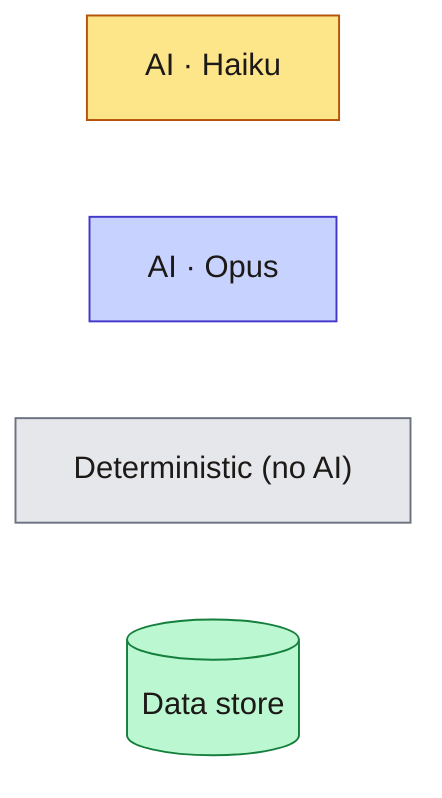
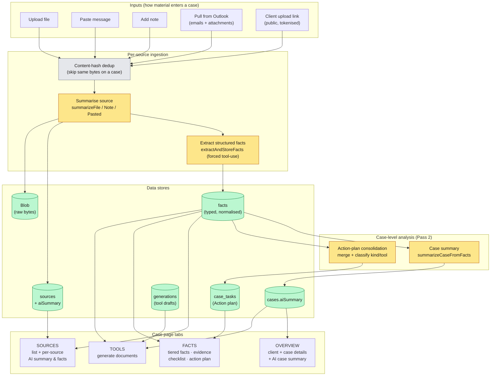
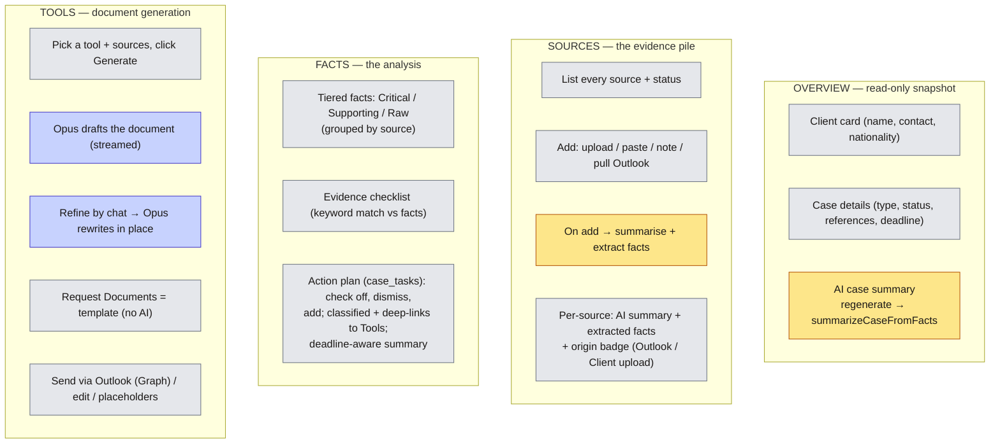
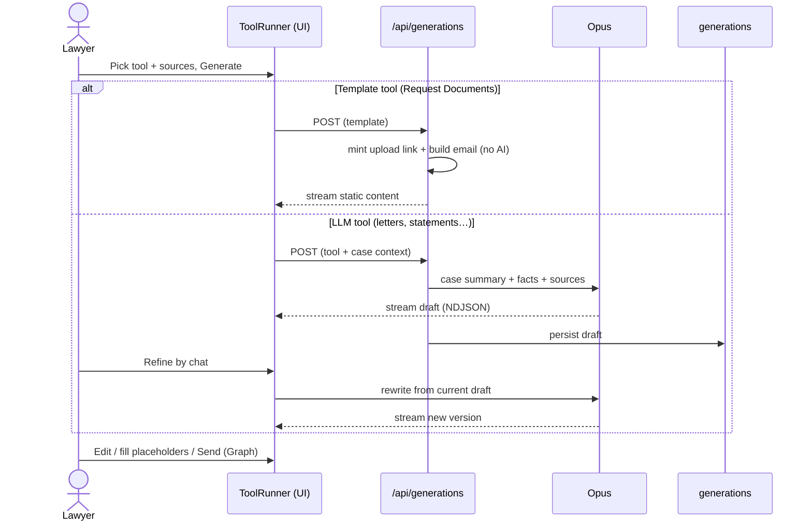

# How the app works — tabs, data, and AI calls

A case page has four tabs (**Overview · Sources · Facts · Tools**). This doc
maps what each tab does, where the AI calls happen, which model runs, and
what each one produces.

> **Models** — `claude-haiku-4-5` (Haiku) does the per-source and case-level
> analysis; `claude-opus-4-8` (Opus) drafts the Tools documents. The Facts
> tiering and the Evidence checklist are **deterministic** (no AI).
>
> **Rendered images** (open directly — no Mermaid viewer needed) live in
> [`diagrams/`](./diagrams): `02-dataflow.png` is the main one, plus
> `01-legend`, `03-tabs`, `04-tools-sequence` (PNG + SVG each). Regenerate
> with `npx @mermaid-js/mermaid-cli -i TABS.md -o diagrams/TABS.png -b white -s 2`.

## Legend

## End-to-end dataflow

## What each tab does

## Tools tab — generation sequence

## Where every AI call lives

| Trigger | Where | Model | Produces |
|---|---|---|---|
| Add a source (upload/paste/note/Outlook/client) | `summarizeFile / summarizeNote / summarizePastedMessage` | Haiku | `sources.aiSummary` |
| Add a source | `extractAndStoreFacts` (forced tool-use, temp 0) | Haiku | rows in `facts` |
| Regenerate summary / Reanalyze | `summarizeCaseFromFacts` | Haiku | `cases.aiSummary` |
| Regenerate summary / Reanalyze | `consolidateCaseActionItems` (merge + classify) | Haiku | `case_tasks` |
| Tools → Generate | `streamGeneration` | Opus | a `generations` draft |
| Tools → Refine | `/api/generations/[id]/messages` | Opus | rewritten draft |
| Facts tiering, Evidence checklist, Request Documents email | — | none | deterministic |
